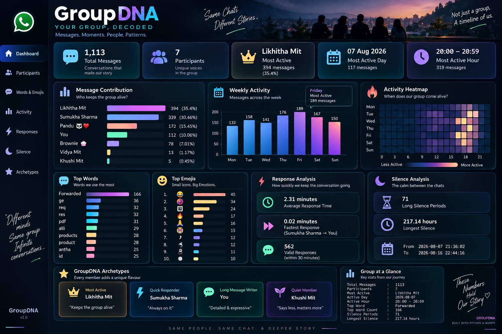

🧬 GroupDNA — Your WhatsApp Group, Decoded

A Python & NumPy-based Minor Project for analyzing WhatsApp group conversations and discovering activity patterns, communication behavior, and group insights.

📊 Project Overview

GroupDNA analyzes an exported WhatsApp chat .txt file and transforms raw conversation data into meaningful insights using Python fundamentals and NumPy.

The notebook performs:

💬 Message parsing and cleaning
👥 Participant analysis
📊 Message contribution analysis
📅 Daily activity analysis
🕐 Hourly activity analysis
🔥 NumPy-based activity heatmap
🔤 Word frequency analysis
😂 Emoji analysis
⚡ Response-time analysis
🤫 Silence-period analysis
💬 Conversation-burst analysis
✍️ Participant message-length analysis
🧩 Data-based participant archetypes
📈 Key Results
Metric	Result
💬 Clean Messages	1,113
👥 Participants	7
🏆 Most Active	Likhitha Mit — 394 messages
👻 Least Active	Khushi Mit — 5 messages
📅 Most Active Date	7 August 2026 — 117 messages
🕐 Most Active Hour	20:00–20:59 — 319 messages
🔤 Most Used Word	Forwarded — 166 times
⚡ Valid Responses	562
⏱️ Average Response Time	2.31 minutes
🤫 Long Silence Periods	71
💤 Longest Silence	217.14 hours
💬 Longest Conversation Burst	116 messages
⏱️ Burst Duration	17.52 minutes
👥 Participant Analysis
Participant	Messages	Contribution	Avg. Message Length	Avg. Response	Archetype
Likhitha Mit	394	35.40%	27.40 chars	2.39 min	Most Active
Sumukha Sharma	339	30.46%	46.90 chars	1.49 min	Quick Responder
Pandu 🐼♥️	172	15.45%	33.33 chars	2.61 min	—
You	112	10.06%	48.83 chars	3.24 min	Long Message Writer
Brownie 🧁	78	7.01%	13.56 chars	2.41 min	—
Vidya Mit	13	1.17%	13.23 chars	4.19 min	—
Khushi Mit	5	0.45%	27.20 chars	3.52 min	Quiet Member
🔥 Activity Analysis

The project creates a 7 × 24 NumPy activity matrix, representing:

7 days of the week
24 hours in each day

The matrix is then converted into a text-based heatmap using block characters such as:

.  ░  ▒  ▓  █

This allows activity intensity to be viewed directly in the notebook without using Matplotlib, Seaborn, or Plotly.

Peak Activity

Most active date:
📅 7 August 2026 — 117 messages

Most active hour:
🕐 20:00–20:59 — 319 messages

🔤 Word Analysis

The notebook processes message text using basic Python string operations and a manually defined stop-word set.

Top 10 Words
1. Forwarded — 166
2. ge        — 36
3. req       — 32
4. res       — 32
5. pdf       — 31
6. alli      — 29
7. products  — 28
8. product   — 28
9. antha     — 25
10. id       — 25

The most frequently detected word was “Forwarded”, appearing 166 times.

😂 Emoji Analysis

The notebook also counts non-alphanumeric Unicode characters to identify frequently occurring emoji/symbol characters.

Top detected entries include:

😂 — 45
🤣 — 34
🔥 — 17
🙏 — 16
😭 — 15

Some Unicode components such as 🏻, ’, ್, ಿ, and ️ are also detected by the character-level counting approach.

⚡ Response Analysis

Response behavior is calculated by comparing consecutive messages from different participants.

The notebook uses a 30-minute response window for average response calculations.

Results
Valid responses: 562
Average response time: 2.31 minutes
Fastest detected response: 0.02 minutes
Fastest response pair: Sumukha Sharma → You
Average Response by Participant
Sumukha Sharma : 1.49 minutes
Likhitha Mit   : 2.39 minutes
Pandu 🐼♥️     : 2.61 minutes
Brownie 🧁     : 2.41 minutes
You            : 3.24 minutes
Khushi Mit     : 3.52 minutes
Vidya Mit      : 4.19 minutes

Response time represents the gap between consecutive messages from different participants; it is not WhatsApp's threaded-reply metric.

🤫 Silence Analysis

The project identifies gaps of 6 hours or more between consecutive messages.

Results
Long silence periods: 71
Longest silence: 217.14 hours
Start: 7 August 2026, 21:36:02
End: 16 August 2026, 22:44:16

This helps identify periods where the group had very little or no conversation activity.

💬 Conversation Burst

The notebook also identifies continuous conversation bursts where consecutive messages occur within 30 minutes of each other.

Longest Conversation Burst
Messages : 116
Started  : 7 August 2026, 19:44:32
Ended    : 7 August 2026, 20:02:03
Duration : 17.52 minutes
🧩 GroupDNA Archetypes

The notebook assigns simple behavioral labels using quantitative chat statistics:

Likhitha Mit    → Most Active
Sumukha Sharma  → Quick Responder
You             → Long Message Writer
Khushi Mit      → Quiet Member

Other participants did not receive a special archetype under the implemented rules.

🛠️ Technologies Used
🐍 Python
🔢 NumPy
📅 datetime
📁 File Handling
🔤 Python String Processing
📊 Exploratory Data Analysis
🧹 Data Cleaning
Project Constraints

The project was implemented without:

❌ Pandas
❌ Matplotlib
❌ Seaborn
❌ Plotly
❌ Regex
❌ collections.Counter
❌ Scikit-learn
❌ NLTK
❌ Pre-built WhatsApp analyzers

The activity heatmap is created using NumPy, while the visual output is rendered directly in the console/notebook.

🔄 Project Workflow
WhatsApp Chat Export
        ↓
Raw .txt File
        ↓
Message Parsing
        ↓
System / Deleted / Media Filtering
        ↓
Timestamp Processing
        ↓
Participant Analysis
        ↓
Word & Emoji Analysis
        ↓
NumPy Activity Matrix
        ↓
Response-Time Analysis
        ↓
Silence Analysis
        ↓
Conversation Burst Analysis
        ↓
Participant Archetypes
        ↓
Final GroupDNA Report
📊 Dashboard

The project includes a GroupDNA dashboard that presents the major analytical findings in a compact visual format.

Add your dashboard image to the repository and use:

📁 Repository Structure
GroupDNA_minorproject_1/
│
├── GroupDNA.png
├── GroupDNAprojectSumukh.ipynb
└── README.md
🤖 AI Disclosure

The notebook contains the following disclosure:

AI tools were used for guidance in understanding Python concepts, debugging errors, and structuring parts of the analysis. The dataset was analyzed using Python and NumPy according to the project requirements.

🔐 Privacy

WhatsApp conversations may contain private information.

The raw chat export should not be publicly uploaded to GitHub unless appropriate permission has been obtained. The repository should contain only permitted/anonymized data or the project output.

🎓 Academic Project

Project: GroupDNA — Your WhatsApp Group, Decoded
Project Type: Minor Project
Domain: Data Analytics
Student: Sumukh R
Department: Computer Science and Business Systems
Institution: Maharaja Institute of Technology Mysuru

⭐ Conclusion

GroupDNA demonstrates how raw WhatsApp conversations can be transformed into structured analytical insights using Python fundamentals and NumPy.

The project focuses on understanding who contributes, when the group is most active, what words appear frequently, how quickly participants respond, when conversations go silent, and how measurable chat behaviors can be summarized into simple archetypes.
The archetypes are based on measurable chat behavior from the notebook, not psychological or personality assessments.
